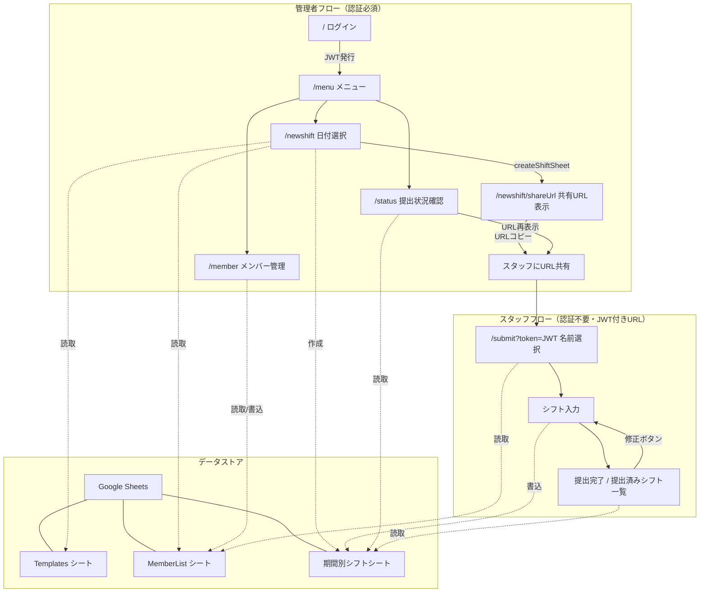
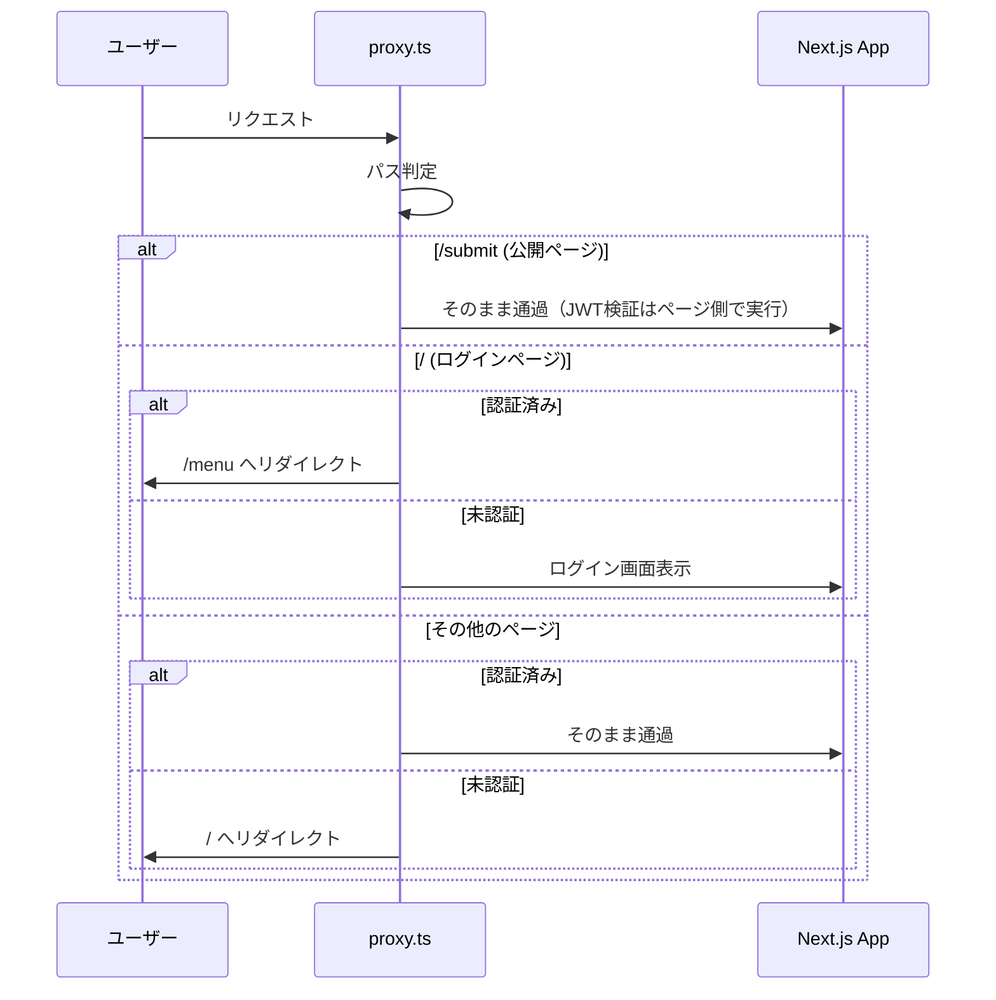
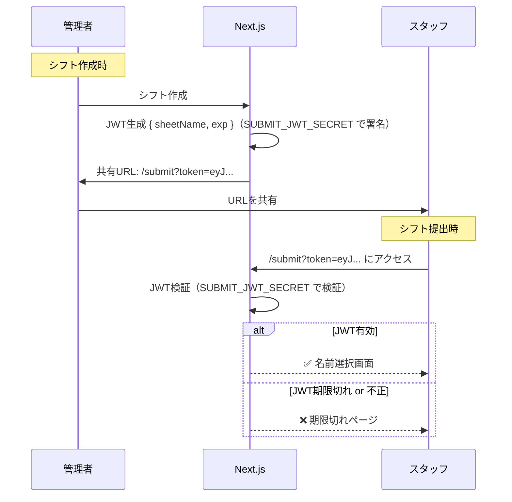
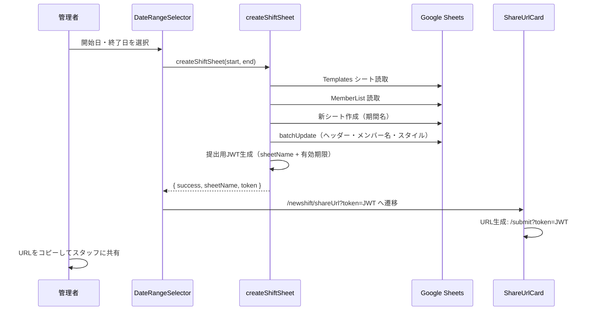
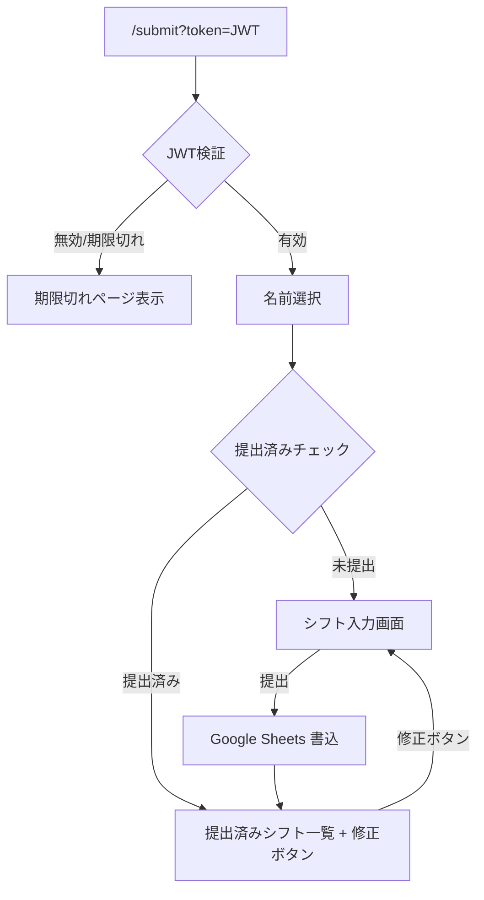

# シフト管理アプリ — システムアーキテクチャ

## 技術スタック

| レイヤー       | 技術                                     |
| -------------- | ---------------------------------------- |
| フレームワーク | Next.js (App Router)                     |
| 言語           | TypeScript                               |
| スタイリング   | Tailwind CSS                             |
| 認証           | JWT (`jose`) + Cookie                    |
| データストア   | Google Sheets API (`google-spreadsheet`) |
| デプロイ       | Vercel (無料プラン)                      |
| アーキテクチャ | Bulletproof React (Feature-based)        |

---

## ユーザーフロー全体図



---

## ディレクトリ構成と役割

```
src/
├── proxy.ts                    # 認証ミドルウェア（JWT検証、/submit は除外）
│
├── app/                        # ルーティング（App Router）
│   ├── page.tsx                #   / → ログイン画面
│   ├── menu/page.tsx           #   /menu → 管理メニュー
│   ├── member/page.tsx         #   /member → メンバー管理
│   ├── status/page.tsx         #   /status → 提出状況確認 + 共有URL再表示
│   ├── newshift/
│   │   ├── page.tsx            #   /newshift → 日付範囲選択
│   │   └── shareUrl/page.tsx   #   /newshift/shareUrl → 共有URL表示
│   ├── submit/page.tsx         #   /submit?token=JWT → 名前選択（公開）
│   └── error.tsx               #   エラーバウンダリ（グローバル）
│
├── features/                   # 機能別モジュール（Bulletproof React）
│   ├── auth/                   #   認証機能
│   │   ├── api/login.ts        #     Server Action: ログイン処理
│   │   ├── components/         #     LoginForm
│   │   └── types/              #     型定義
│   ├── member/                 #   メンバー管理機能
│   │   └── components/         #     MemberList, Member, AddMemberInput
│   ├── newshift/               #   シフト作成機能
│   │   ├── actions/            #     createShiftSheet Server Action
│   │   └── components/         #     DateRangeSelector, ShareUrlCard
│   ├── submit/                 #   シフト提出機能（公開）
│   │   └── components/         #     NameSelector, ShiftInput, SubmissionComplete
│   └── status/                 #   提出状況確認機能
│       └── components/         #     StatusBoard
│
├── lib/                        # 共有ライブラリ（ドメイン非依存）
│   ├── GoogleSheets/
│   │   ├── google.ts           #     Google Sheets 接続
│   │   ├── getMember.ts        #     MemberList 取得（キャッシュ付き）
│   │   ├── addMember.ts        #     メンバー追加
│   │   └── deleteMember.ts     #     メンバー削除
│   └── jose/
│       └── jwt.ts              #     JWT 生成/検証（管理者用 + 提出リンク用、Secret分離）
│
├── components/                 # 共有UIコンポーネント（ドメイン非依存）
│   ├── elements/               #     Button, Input, Accordion, RouterCard, Spinner
│   └── layouts/                #     Header, CenterCardLayout
│
└── utils/
    └── calendar.ts             #   カレンダー生成ユーティリティ
```

---

## 認証フロー



---

## 共有リンクの有効期限（JWT方式）

共有URLにJWTトークンを埋め込み、有効期限をトークン自体に含める。
管理者ログイン用 JWT (`JWT_SECRET`) とは別の Secret (`SUBMIT_JWT_SECRET`) を使用する。



---

## シフト作成のデータフロー



---

## シフト提出フロー（スタッフ側）



- スタッフが名前を選択した時点で、該当シートのそのスタッフの行を参照し、提出済みかどうかを判定
- 提出済みの場合は入力内容を一覧表示し、修正ボタンから再編集可能
- 修正も同一のJWTが有効な期間内のみ可能

---

## 提出状況確認（管理者側）

管理者が `/status` ページから、特定シフト期間の提出状況を一覧で確認できる。

| 機能          | 説明                                             |
| ------------- | ------------------------------------------------ |
| 提出状況一覧  | メンバーごとに「提出済み / 未提出」を表示        |
| 共有URL再表示 | 該当期間のJWTトークン付きURLを再表示・コピー可能 |

> **注意**: JWTは `createShiftSheet` 時に1度だけ生成される。URL再表示のためにトークンをサーバー側（Google Sheets のメタデータセルなど）に保存する必要がある。

---

## 非機能要件

### エラーバウンダリ

Next.js の `error.tsx` を使い、グローバルにエラーをキャッチする。

| 状況                   | 表示                                                                             |
| ---------------------- | -------------------------------------------------------------------------------- |
| Google Sheets API 障害 | 「現在サービスに接続できません。しばらくしてから再試行してください。」           |
| JWT 期限切れ           | 「このリンクは有効期限が切れています。管理者に新しいリンクを依頼してください。」 |
| 予期せぬエラー         | 「エラーが発生しました。再読み込みしてください。」+ リトライボタン               |

### ローディング状態の統一

共有の `Spinner` コンポーネントを作成し、全てのAPI呼び出しで統一的に使用する。

| 対象                 | ローディングUI                       |
| -------------------- | ------------------------------------ |
| ページ遷移           | Next.js `loading.tsx` でスピナー表示 |
| Server Action 実行中 | ボタン内スピナー + disabled 状態     |
| データ取得中         | コンテンツエリアにスピナー表示       |

### キャッシュ

| 対象             | 戦略                                                                                                                 |
| ---------------- | -------------------------------------------------------------------------------------------------------------------- |
| `getMember()`    | Next.js `unstable_cache` または `fetch` の `revalidate` でキャッシュ。メンバー追加/削除時に `revalidateTag` で無効化 |
| 提出済みチェック | キャッシュしない（最新状態を常に参照する必要があるため）                                                             |

### JWT Secret の分離

| 用途           | 環境変数            | 有効期限            |
| -------------- | ------------------- | ------------------- |
| 管理者ログイン | `JWT_SECRET`        | 30分                |
| 提出リンク     | `SUBMIT_JWT_SECRET` | 設定可能（例: 7日） |

### デプロイ

| 項目         | 内容                        |
| ------------ | --------------------------- |
| ホスティング | Vercel (無料プラン)         |
| 環境変数     | Vercel Dashboard で設定     |
| ビルド       | `next build` → 自動デプロイ |

### セキュリティ

| 項目        | 対策                                                                   |
| ----------- | ---------------------------------------------------------------------- |
| CSRF        | Next.js Server Actions の組み込み保護（Origin ヘッダー検証）で対応済み |
| JWT 改ざん  | 署名検証 (`jose`) で防止                                               |
| Secret 分離 | 管理者用と提出用で Secret を分けることで権限昇格を防止                 |

---

## ページ一覧と状態

| パス                 | 認証    | 状態            | 説明                                  |
| -------------------- | ------- | --------------- | ------------------------------------- |
| `/`                  | 不要    | ✅ 完了         | ログイン画面                          |
| `/menu`              | 必須    | ✅ 完了         | 管理メニュー                          |
| `/newshift`          | 必須    | ✅ 完了         | 日付範囲選択                          |
| `/newshift/shareUrl` | 必須    | ✅ 完了         | 共有URL表示                           |
| `/member`            | 必須    | ✅ 完了         | メンバー管理                          |
| `/status`            | 必須    | ❌ 未実装       | 提出状況確認 + 共有URL再表示          |
| `/submit?token=JWT`  | **JWT** | 🔧 名前選択まで | 名前選択 → シフト入力 → 提出完了/修正 |
