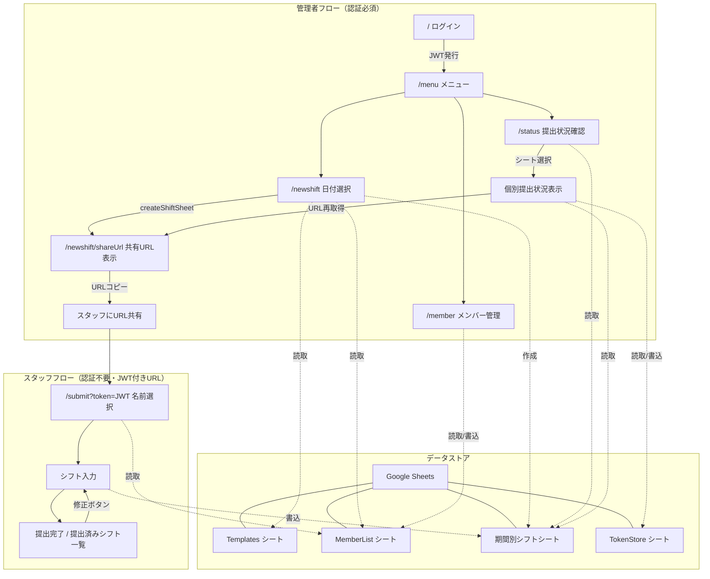
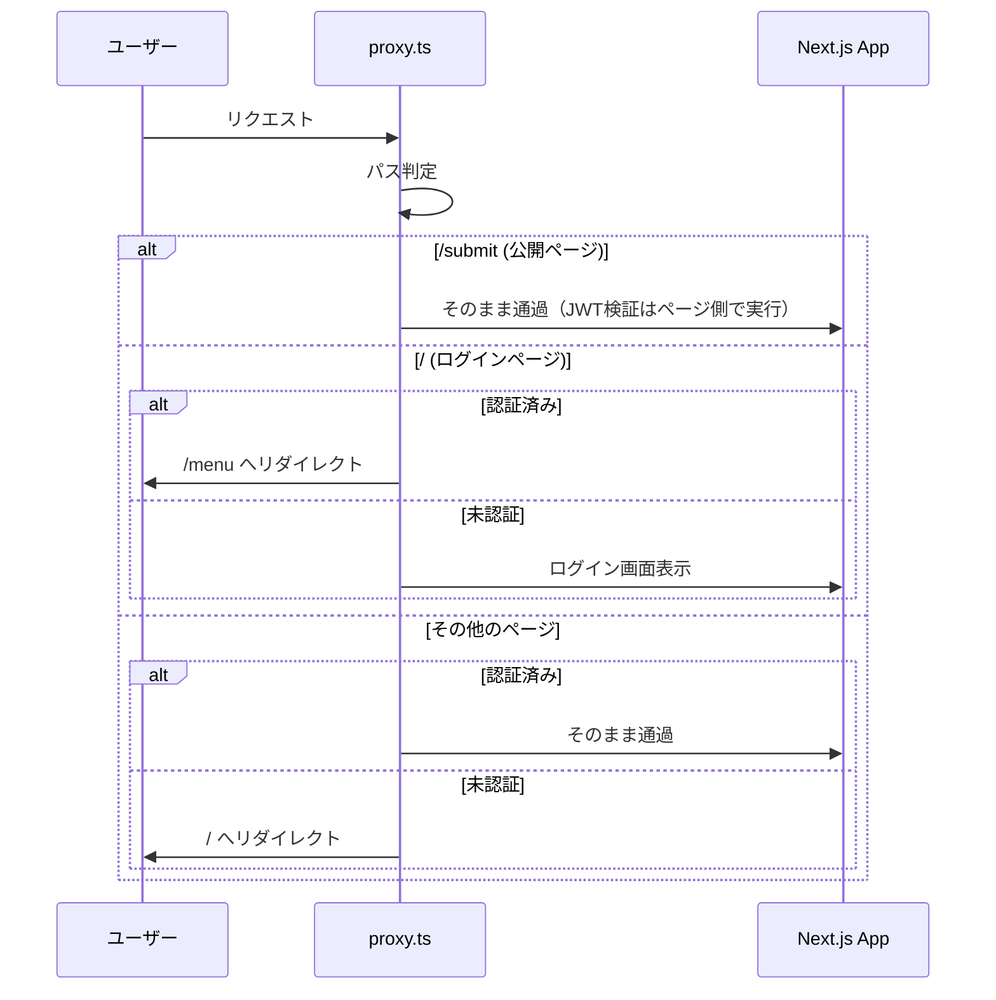
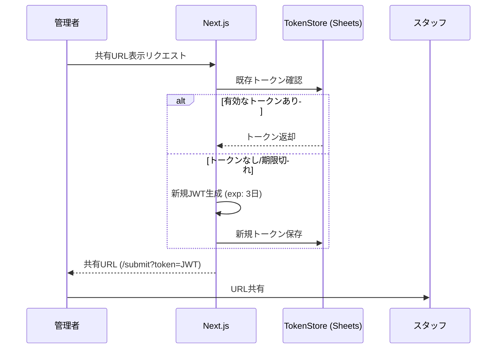

# シフト管理アプリ — システムアーキテクチャ

## 技術スタック

| レイヤー       | 技術                                     |
| -------------- | ---------------------------------------- |
| フレームワーク | Next.js (App Router)                     |
| 言語           | TypeScript                               |
| スタイリング   | Tailwind CSS                             |
| 認証           | JWT (`jose`) + Cookie                    |
| データストア   | Google Sheets API (`google-spreadsheet`) |
| デプロイ       | Vercel (無料プラン)                      |
| アーキテクチャ | Bulletproof React (Feature-based)        |
| テスト         | Vitest                                   |

---

## ユーザーフロー全体図



---

## ディレクトリ構成と役割

```
src/
├── proxy.ts                    # 認証ミドルウェア（JWT検証、/submit は除外）
│
├── app/                        # ルーティング（App Router）
│   ├── page.tsx                #   / → ログイン画面
│   ├── menu/page.tsx           #   /menu → 管理メニュー
│   ├── member/page.tsx         #   /member → メンバー管理
│   ├── status/page.tsx         #   /status → 提出状況確認（一覧 & 詳細）
│   ├── newshift/
│   │   ├── page.tsx            #   /newshift → 日付範囲選択
│   │   └── shareUrl/page.tsx   #   /newshift/shareUrl → 共有URL表示
│   ├── submit/page.tsx         #   /submit?token=JWT → 名前選択 & シフト入力
│   └── error.tsx               #   エラーバウンダリ
│
├── features/                   # 機能別モジュール
│   ├── auth/                   #   認証機能
│   │   ├── api/login.ts        #     Server Action: ログイン処理
│   │   └── components/         #     LoginForm
│   ├── member/                 #   メンバー管理機能
│   │   └── components/         #     MemberList, Member, AddMemberInput
│   ├── newshift/               #   シフト作成機能
│   │   ├── actions/            #     createShiftSheet Server Action
│   │   └── components/         #     DateRangeSelector, ShareUrlCard
│   ├── submit/                 #   シフト提出機能（スタッフ用）
│   │   ├── actions/            #     submitShift Server Action
│   │   └── components/         #     NameSelector, ShiftInput, SubmissionComplete
│   └── status/                 #   提出状況確認機能（管理者用）
│       └── components/         #     StatusBoard
│
├── lib/                        # 共有ライブラリ
│   ├── GoogleSheets/
│   │   ├── google.ts           #     Google Sheets 接続基盤
│   │   ├── getMember.ts        #     MemberList 取得
│   │   ├── addMember.ts        #     メンバー追加
│   │   ├── deleteMember.ts     #     メンバー削除
│   │   ├── getSheetToken.ts    #     シート別JWTの取得・生成
│   │   ├── tokenStore.ts       #     TokenStore シート操作 (CRUD)
│   │   ├── getSubmissionStatus.ts #  提出状況・シート一覧取得
│   │   └── getStaffShift.ts    #     個人の提出済みシフト取得
│   └── jose/
│       └── jwt.ts              #     JWT 生成/検証
│
├── components/                 # 共有UIコンポーネント
│   ├── elements/               #     Button, Input, Accordion, Spinner 等
│   └── layouts/                #     Header, CenterCardLayout
│
└── utils/
    └── calendar.ts             #   カレンダー生成ロジック
```

---

## 認証フロー



---

## 共有リンクの管理（TokenStore 方式）

共有URLに使用するJWTは、有効期限内であれば同一のものを使い回せるよう `TokenStore` シートで管理する。

### トークン取得・生成フロー
1. 管理者が共有URLをリクエスト（`/newshift/shareUrl` または `/status`）。
2. `TokenStore` シートから該当シート名のトークンを検索。
3. トークンが存在し、かつ有効期限内であればそれを返す。
4. 期限切れ、または存在しない場合は新規発行し、`TokenStore` を更新する。



---

## シフト提出とデータ更新

スタッフが提出したシフトは、指定されたシートの該当するスタッフの行に直接書き込まれる。

### 更新ロジック
- スタッフ名で行を特定（5行目以降）。
- 各日付に対応する列に値を書き込む。
- 書き込み時、セルの中央揃え等のフォーマットを維持する。

---

## 非機能要件

### キャッシュ戦略
- `getMember()`: `unstable_cache` 等を利用し、メンバー一覧をキャッシュ。追加・削除時にタグベースで revalidate。
- 提出状況: リアルタイム性が求められるため、キャッシュせず常に最新のシートを参照。

### セキュリティ
- **JWT Secret**: 管理者用 (`JWT_SECRET`) と提出リンク用 (`SUBMIT_JWT_SECRET`) を分離。
- **Token Cleanup**: 有効期限を過ぎた不当なアクセスを検知した際、`TokenStore` から該当トークンを削除。

---

## ページ一覧

| パス                 | 権限    | ステータス | 役割                                  |
| -------------------- | ------- | ---------- | ------------------------------------- |
| `/`                  | 公開    | ✅ 完了    | 管理者ログイン画面                    |
| `/menu`              | 管理者  | ✅ 完了    | 管理メインメニュー                    |
| `/newshift`          | 管理者  | ✅ 完了    | 新規シフト表作成（期間選択）          |
| `/newshift/shareUrl` | 管理者  | ✅ 完了    | 作成直後の共有URL表示                 |
| `/member`            | 管理者  | ✅ 完了    | メンバー（スタッフ）一覧管理          |
| `/status`            | 管理者  | ✅ 完了    | 提出状況確認・URL再取得               |
| `/submit?token=JWT`  | トークン | ✅ 完了    | スタッフ用シフト入力・修正            |

---

## テスト方針

- **ユニットテスト**: `vitest` を使用。
- **方針**: ロジックの重いユーティリティ (`calendar.ts`) や、データ操作を伴う `lib/GoogleSheets` の各関数に対してテストを記述する。
- **モック**: Google Sheets API や JWT モジュールをモックし、環境に依存しないテスト実行を保証する。
