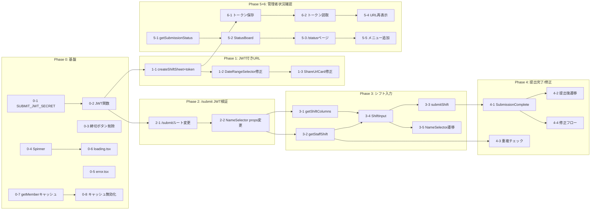

# MVP タスク計画

ARCHITECTURE.md に基づく、MVP 実装のためのステップバイステップ計画。
各タスクは小さく、テスト可能で、一つの関心ごとに集中している。

> **前提**: 以下のファイルは既に実装済み
>
> - ログイン (`/`)、メニュー (`/menu`)、メンバー管理 (`/member`)
> - 日付範囲選択 (`/newshift`)、シフト表作成 (`createShiftSheet`)
> - 共有URL表示 (`/newshift/shareUrl`)、名前選択画面 (`NameSelector`)
> - 認証ミドルウェア (`proxy.ts`)、Google Sheets 接続 (`lib/GoogleSheets/`)

---

## Phase 0: 基盤整備

既存コードの修正・非機能要件の基盤を先に整える。

### 0-1. `SUBMIT_JWT_SECRET` 環境変数の追加

- **ファイル**: `.env.local`
- **やること**: `SUBMIT_JWT_SECRET` をランダムな文字列で追加する
- **テスト**: 環境変数が読み込めることを `console.log(process.env.SUBMIT_JWT_SECRET)` で確認（確認後削除）

### 0-2. 提出リンク用 JWT 生成関数の作成

- **ファイル**: `src/lib/jose/jwt.ts`
- **やること**: 既存の `signToken` / `verifyToken` とは**別に** `signSubmitToken(sheetName: string, expiresInDays: number)` と `verifySubmitToken(token: string)` を追加する。`SUBMIT_JWT_SECRET` を使用し、ペイロードは `{ sheetName: string }` とする
- **テスト**: テスト用のトークンを生成し、検証が通ることを確認。期限切れトークン（`expiresInDays: 0`）で `null` が返ることを確認

### 0-3. メニューから「提出締切」ボタンを削除

- **ファイル**: `src/app/menu/page.tsx`
- **やること**: 「提出締切」の `RouterCard`（L20-27）を削除する
- **テスト**: `/menu` にアクセスし、「新規シフト作成」と「メンバーの追加・削除」の2つだけが表示されることを確認

### 0-4. 共有 Spinner コンポーネントの作成

- **ファイル**: `src/components/elements/Spinner.tsx`、`src/components/elements/index.ts`
- **やること**: 再利用可能なスピナーコンポーネントを作成し、`index.ts` から export する。サイズ（`sm` / `md` / `lg`）と色を props で指定可能にする
- **テスト**: Storybook またはテスト用ページで3サイズが正しく表示されることを確認

### 0-5. グローバルエラーバウンダリの作成

- **ファイル**: `src/app/error.tsx`
- **やること**: `'use client'` コンポーネントとして作成。エラーメッセージ表示 + 「再読み込み」ボタンを含める。`reset` 関数を呼ぶリトライ機能を実装する
- **テスト**: 意図的にエラーを throw するテスト用ページで、エラーバウンダリが表示されることを確認

### 0-6. グローバル loading.tsx の作成

- **ファイル**: `src/app/loading.tsx`
- **やること**: 0-4 で作成した `Spinner` を使ってページ遷移時のローディングUIを表示する
- **テスト**: 遅いページ遷移をシミュレートし（Server Component 内で `await new Promise(r => setTimeout(r, 2000))`）、スピナーが表示されることを確認

### 0-7. `getMember` にキャッシュを追加

- **ファイル**: `src/lib/GoogleSheets/getMember.ts`
- **やること**: Next.js の `unstable_cache` で `getMember` の結果をキャッシュする。タグ `member-list` を付与する
- **テスト**: 2回連続でページをリロードし、2回目が高速（キャッシュヒット）であることを確認

### 0-8. メンバー追加・削除時にキャッシュを無効化

- **ファイル**: `src/lib/GoogleSheets/addMember.ts`、`src/lib/GoogleSheets/deleteMember.ts`
- **やること**: 各関数の成功時に `revalidateTag('member-list')` を呼ぶ
- **テスト**: メンバーを追加 → メンバー一覧をリロード → 追加したメンバーが反映されていることを確認

---

## Phase 1: JWT 付き共有URL

シフト作成からJWT付きURLの共有までの流れを完成させる。

### 1-1. `createShiftSheet` からJWTトークンを返す

- **ファイル**: `src/features/newshift/actions/createShiftSheet.ts`
- **やること**: シフト作成成功時に `signSubmitToken(sheetName, 7)` を呼び、戻り値に `token` を追加する。`return { success: true, sheetName, token }`
- **テスト**: `createShiftSheet` を実行し、レスポンスに `token` が含まれることを確認

### 1-2. `DateRangeSelector` で token をクエリパラメータに含める

- **ファイル**: `src/features/newshift/components/DateRangeSelector/DateRangeSelector.tsx`
- **やること**: `result.token` を `router.push` のクエリパラメータに含める。`/newshift/shareUrl?token=xxx`
- **テスト**: シフト作成後、`/newshift/shareUrl` のURLに `token` パラメータが含まれることを確認

### 1-3. `ShareUrlCard` のURL生成をJWT方式に変更

- **ファイル**: `src/features/newshift/components/ShareUrlCard.tsx`
- **やること**: `searchParams` から `token` を取得し、共有URLを `${origin}/submit?token=${token}` に変更する。`sheetName` は JWT の payload からデコード（表示用にのみ使用、検証は不要）して日付範囲を表示する
- **テスト**: 共有URL表示ページで `/submit?token=eyJ...` 形式のURLが表示され、コピーが動作することを確認

---

## Phase 2: `/submit` ページのJWT検証

公開ページにJWT検証を組み込む。

### 2-1. `/submit` ルートを動的パスからクエリパラメータ方式に変更

- **ファイル**: `src/app/submit/[sheetName]/page.tsx` → 削除、`src/app/submit/page.tsx` を新規作成
- **やること**: `searchParams` から `token` を取得し、`verifySubmitToken` で検証する。有効な場合は `NameSelector` を表示。無効/期限切れの場合はエラーメッセージ（「このリンクは有効期限が切れています」）を表示
- **テスト**:
    - 有効なトークン付きURLでアクセス → 名前選択画面が表示される
    - 不正なトークンでアクセス → 期限切れメッセージが表示される
    - トークンなしでアクセス → 期限切れメッセージが表示される

### 2-2. `NameSelector` のprops変更

- **ファイル**: `src/features/submit/components/NameSelector.tsx`
- **やること**: `sheetName` prop はそのまま、`token` prop を追加する（次フェーズのシフト入力画面への遷移で使用）。`handleConfirm` の `alert()` は一旦そのまま（Phase 3 で変更）
- **テスト**: 名前選択画面が従来通り動作し、名前を選択して「次へ」が押せることを確認

---

## Phase 3: シフト入力画面

スタッフがシフト（出勤日・時間）を入力する画面を作る。

### 3-1. シフトデータ読み込み用 Server Action の作成

- **ファイル**: `src/lib/GoogleSheets/getShiftColumns.ts`（新規）
- **やること**: `sheetName` を受け取り、該当シートのヘッダー行（日付列一覧）を返す Server Action を作成する。戻り値は `{ columns: { index: number, date: string }[] }`
- **テスト**: 既存のシフト表シート名を指定し、日付列の一覧が返ることを確認

### 3-2. スタッフの既存提出データ読み込み用 Server Action の作成

- **ファイル**: `src/lib/GoogleSheets/getStaffShift.ts`（新規）
- **やること**: `sheetName` と `staffName` を受け取り、該当スタッフの行データを返す。未提出の場合は空データを返す。戻り値は `{ submitted: boolean, shifts: { date: string, value: string }[] }`
- **テスト**: 提出済みスタッフ名 → データあり。未提出スタッフ名 → `submitted: false`

### 3-3. シフト提出用 Server Action の作成

- **ファイル**: `src/features/submit/actions/submitShift.ts`（新規）
- **やること**: `token`、`staffName`、`category`、`shifts`（日付ごとの値の配列）を受け取り、Google Sheets の該当行に書き込む Server Action。`token` は再検証して `sheetName` を取得する。成功時は `{ success: true }`
- **テスト**: テスト用のシフトデータを送信し、Google Sheets の該当セルに値が書き込まれることを確認

### 3-4. `ShiftInput` コンポーネントの作成

- **ファイル**: `src/features/submit/components/ShiftInput.tsx`（新規）
- **やること**: 名前選択後に表示されるシフト入力フォーム。日付ごとに出勤時間を入力するUIを作成する。「提出」ボタンで `submitShift` Server Action を呼ぶ。ローディング中は `Spinner` を表示しボタンを disabled にする
- **テスト**: シフト入力画面が表示され、各日付の入力欄に値を入れて「提出」できることを確認

### 3-5. `NameSelector` から `ShiftInput` への遷移を実装

- **ファイル**: `src/features/submit/components/NameSelector.tsx`
- **やること**: `handleConfirm` を修正し、`alert()` の代わりに選択された名前とカテゴリを state に保存し、`ShiftInput` コンポーネントを表示する（同一ページ内で切り替え、もしくは親コンポーネントでステップ管理）
- **テスト**: 名前選択 → 「次へ」 → シフト入力画面に切り替わることを確認

---

## Phase 4: 提出完了 / 修正フロー

### 4-1. `SubmissionComplete` コンポーネントの作成

- **ファイル**: `src/features/submit/components/SubmissionComplete.tsx`（新規）
- **やること**: 提出済みシフトの一覧（日付と入力値）を表示する。「修正する」ボタンを含める
- **テスト**: 提出データを props で渡し、一覧が正しく表示されることを確認

### 4-2. 提出後に `SubmissionComplete` へ遷移

- **ファイル**: `src/features/submit/components/ShiftInput.tsx`
- **やること**: `submitShift` 成功後、`SubmissionComplete` コンポーネントに切り替える（提出したデータを渡す）
- **テスト**: シフト提出 → 完了画面に遷移 → 提出内容が一覧表示されることを確認

### 4-3. 重複提出防止: 名前選択時の提出済みチェック

- **ファイル**: `src/features/submit/components/NameSelector.tsx`
- **やること**: 「次へ」押下時に `getStaffShift` で提出済みかチェックする。提出済みなら `ShiftInput` ではなく `SubmissionComplete` を表示する
- **テスト**: 提出済みスタッフの名前を選択 → 「次へ」 → 提出済み一覧 + 修正ボタンが表示されることを確認

### 4-4. 修正ボタンから `ShiftInput` への遷移

- **ファイル**: `src/features/submit/components/SubmissionComplete.tsx`
- **やること**: 「修正する」ボタン押下で `ShiftInput` に切り替え、既存データをフォームに初期値として埋める
- **テスト**: 修正ボタン → 入力画面（既存値が入っている） → 再提出 → 完了画面

---

## Phase 5: 管理者向け提出状況確認

### 5-1. 提出状況データ取得用 Server Action の作成

- **ファイル**: `src/lib/GoogleSheets/getSubmissionStatus.ts`（新規）
- **やること**: `sheetName` を受け取り、全メンバーの提出状況（名前・カテゴリ・提出済みかどうか）を返す。シートの各行を走査し、データが入力されているかで判定する
- **テスト**: テストシートに対して実行し、正しい提出状況が返ることを確認

### 5-2. `StatusBoard` コンポーネントの作成

- **ファイル**: `src/features/status/components/StatusBoard.tsx`（新規）
- **やること**: メンバーごとの提出状況を一覧表示する。カテゴリ別にグルーピングし、提出済みは ✅、未提出は ❌ で表示する
- **テスト**: テストデータを props で渡し、正しく表示されることを確認

### 5-3. `/status` ページの作成

- **ファイル**: `src/app/status/page.tsx`（新規）
- **やること**: Server Component として `getSubmissionStatus` を呼び、`StatusBoard` を表示する。対象シフト期間はクエリパラメータまたは一覧から選択する形にする
- **テスト**: `/status` にアクセスし、提出状況一覧が表示されることを確認

### 5-4. 共有URL再表示機能

- **ファイル**: `src/features/status/components/StatusBoard.tsx`（修正）
- **やること**: 該当シフト期間のJWTトークン付き共有URLを再表示できるUIを追加する。トークンは `createShiftSheet` 時に Google Sheets の特定セル（例: シートのメタデータエリア）に保存しておき、それを読み取って表示する
- **テスト**: 提出状況画面で共有URLが表示され、コピーボタンが動作することを確認

### 5-5. メニューに「提出状況確認」ボタンを追加

- **ファイル**: `src/app/menu/page.tsx`
- **やること**: `RouterCard` で「提出状況確認」を追加し、`/status` に遷移するようにする
- **テスト**: メニューに「提出状況確認」カードが表示され、クリックで `/status` に遷移することを確認

---

## Phase 6: トークン保存（Phase 5-4 の前提）

### 6-1. `createShiftSheet` でトークンをシートに保存

- **ファイル**: `src/features/newshift/actions/createShiftSheet.ts`
- **やること**: JWT トークンを生成した後、シートの特定セル（例: メタデータ領域）にトークン文字列を保存する
- **テスト**: シフト作成後、該当シートの指定セルにトークンが書き込まれていることを確認

### 6-2. トークン読み取り用 Server Action の作成

- **ファイル**: `src/lib/GoogleSheets/getSheetToken.ts`（新規）
- **やること**: `sheetName` を受け取り、該当シートからトークンを読み取って返す
- **テスト**: 保存済みのシートからトークンが正しく読み取れることを確認

---

## 依存関係グラフ

