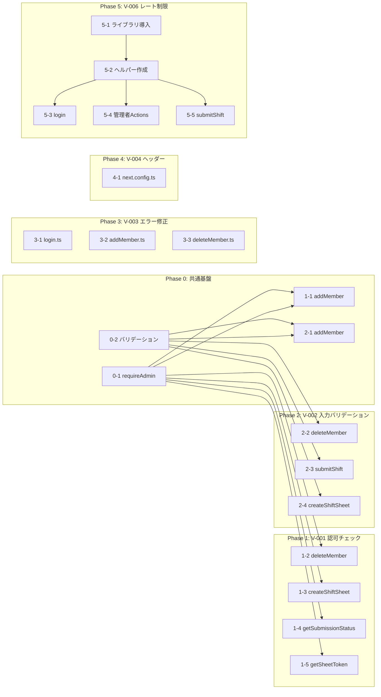

# セキュリティ修正 MVP タスク計画

セキュリティ脆弱性検証レポート（V-001〜V-004, V-006）に基づく修正タスク。
各タスクは小さく、テスト可能で、一つの関心ごとに集中している。

> **対象脆弱性**:
>
> - V-001: Server Actions の認可チェック不備
> - V-002: Server Actions の入力バリデーション不足
> - V-003: エラーメッセージによる情報漏洩
> - V-004: セキュリティヘッダーの未設定
> - V-006: レート制限なし

---

## Phase 0: 共通基盤

認可チェックやバリデーションで再利用する共通ヘルパーを先に作成する。

### 0-1. 管理者認可ヘルパー関数の作成

- **ファイル**: `src/lib/auth/requireAdmin.ts`（新規）
- **やること**: Cookie から `auth_token` を取得し、`verifyToken` で検証する関数を作成。検証失敗時は例外をスローする
- **インターフェース**:
    ```typescript
    export async function requireAdmin(): Promise<JWTPayload>;
    // 成功: payload を返す
    // 失敗: throw new Error('Unauthorized')
    ```
- **テスト**: 有効トークン → payload 返却 / トークンなし → 例外 / 無効トークン → 例外

### 0-2. 汎用バリデーションユーティリティの作成

- **ファイル**: `src/lib/validation/index.ts`（新規）
- **やること**: 各 Server Action で使う共通バリデーション関数を作成
- **含める関数**:
    ```typescript
    // 文字列の長さ・空チェック
    export function validateString(value: unknown, maxLength?: number): string;
    // カテゴリのホワイトリスト検証
    export function validateCategory(value: unknown): MemberCategory;
    // シフト値のフォーマット検証（"hh.m ~ hh.m" 形式）
    export function validateShiftValue(value: unknown): string;
    // 列インデックスの範囲検証
    export function validateColIndex(
        value: unknown,
        min: number,
        max: number
    ): number;
    ```
- **テスト**: 各関数の正常系・異常系をユニットテスト

---

## Phase 1: V-001 修正 — Server Actions 認可チェック追加

管理者専用 Server Actions に認可チェックを追加する。

### 1-1. `addMember` に認可チェックを追加

- **ファイル**: `src/lib/GoogleSheets/addMember.ts`
- **やること**: 関数の冒頭で `await requireAdmin()` を呼ぶ。検証失敗時は `{ success: false, error: '認証エラー' }` を返す
- **テスト**: 管理者Cookie なし → エラー返却 / 管理者Cookie あり → 正常動作

### 1-2. `deleteMember` に認可チェックを追加

- **ファイル**: `src/lib/GoogleSheets/deleteMember.ts`
- **やること**: 1-1 と同様に `requireAdmin()` を追加
- **テスト**: 管理者Cookie なし → エラー返却

### 1-3. `createShiftSheet` に認可チェックを追加

- **ファイル**: `src/features/newshift/actions/createShiftSheet.ts`
- **やること**: 1-1 と同様に `requireAdmin()` を追加
- **テスト**: 管理者Cookie なし → エラー返却

### 1-4. `getSubmissionStatus` / `getShiftSheetNames` に認可チェックを追加

- **ファイル**: `src/lib/GoogleSheets/getSubmissionStatus.ts`
- **やること**: 両関数に `requireAdmin()` を追加
- **テスト**: 管理者Cookie なし → 空データ or エラー返却

### 1-5. `getSheetToken` に認可チェックを追加

- **ファイル**: `src/lib/GoogleSheets/getSheetToken.ts`
- **やること**: `requireAdmin()` を追加
- **テスト**: 管理者Cookie なし → `{ token: null }` を返却

---

## Phase 2: V-002 修正 — 入力バリデーション追加

### 2-1. `addMember` に入力バリデーションを追加

- **ファイル**: `src/lib/GoogleSheets/addMember.ts`
- **やること**:
    - `name`: 空文字チェック、最大50文字制限、前後空白トリム
    - `category`: `LunchStaff | LunchPartTime | DinnerStaff | DinnerPartTime` のホワイトリスト検証
- **テスト**: 空文字 → エラー / 不正カテゴリ → エラー / 51文字 → エラー / 正常値 → 成功

### 2-2. `deleteMember` に入力バリデーションを追加

- **ファイル**: `src/lib/GoogleSheets/deleteMember.ts`
- **やること**: 2-1 と同様に `name` と `category` を検証
- **テスト**: 空文字 → エラー / 不正カテゴリ → エラー

### 2-3. `submitShift` に入力バリデーションを追加

- **ファイル**: `src/features/submit/actions/submitShift.ts`
- **やること**:
    - `staffName`: 空文字チェック、最大50文字
    - `shifts` 配列: 最大50件まで制限
    - `shifts[].colIndex`: 0以上の整数、上限チェック（例: 100以下）
    - `shifts[].value`: 空文字 or `hh.m ~ hh.m` 形式（正規表現 `/^\d{1,2}\.[05] ~ \d{1,2}\.[05]$/`）
- **テスト**:
    - `colIndex: -1` → エラー
    - `value: "<script>alert(1)</script>"` → エラー
    - `value: "10.0 ~ 18.0"` → 成功

### 2-4. `createShiftSheet` に入力バリデーションを追加

- **ファイル**: `src/features/newshift/actions/createShiftSheet.ts`
- **やること**:
    - `startDate`, `endDate`: 有効な Date であること、`startDate <= endDate` であること
    - 日付範囲が 90 日以内であること（DoS 防止）
- **テスト**: `endDate < startDate` → エラー / 91日範囲 → エラー / 正常範囲 → 成功

---

## Phase 3: V-003 修正 — エラーメッセージの情報漏洩修正

### 3-1. `login.ts` のエラーメッセージ修正

- **ファイル**: `src/features/auth/api/login.ts`
- **やること**: `catch` ブロックの `error` オブジェクトをクライアントに返さない。サーバーログに記録し、汎用メッセージのみ返す
- **変更前**: `'認証中にエラーが発生しました: ' + error`
- **変更後**: `'認証中にエラーが発生しました'`（`console.error` でサーバーログに記録）
- **テスト**: 意図的にエラーを発生させ、レスポンスにスタックトレースが含まれないことを確認

### 3-2. `addMember.ts` のエラーメッセージ修正

- **ファイル**: `src/lib/GoogleSheets/addMember.ts`
- **変更前**: `'メンバーの追加に失敗しました: ' + error`
- **変更後**: `'メンバーの追加に失敗しました'`
- **テスト**: レスポンスに内部エラー情報が含まれないことを確認

### 3-3. `deleteMember.ts` のエラーメッセージ修正

- **ファイル**: `src/lib/GoogleSheets/deleteMember.ts`
- **変更前**: `'メンバーの削除に失敗しました: ' + error`
- **変更後**: `'メンバーの削除に失敗しました'`
- **テスト**: レスポンスに内部エラー情報が含まれないことを確認

---

## Phase 4: V-004 修正 — セキュリティヘッダー設定

### 4-1. `next.config.ts` にセキュリティヘッダーを追加

- **ファイル**: `next.config.ts`
- **やること**: `headers()` 関数で以下のヘッダーを全ルートに設定
    ```typescript
    const nextConfig: NextConfig = {
        headers: async () => [
            {
                source: '/(.*)',
                headers: [
                    { key: 'X-Content-Type-Options', value: 'nosniff' },
                    { key: 'X-Frame-Options', value: 'DENY' },
                    {
                        key: 'Strict-Transport-Security',
                        value: 'max-age=63072000; includeSubDomains; preload',
                    },
                    {
                        key: 'Referrer-Policy',
                        value: 'strict-origin-when-cross-origin',
                    },
                    { key: 'X-XSS-Protection', value: '0' },
                ],
            },
        ],
    };
    ```
- **テスト**: `curl -I http://localhost:3000` でレスポンスヘッダーに設定した値が含まれることを確認

---

## Phase 5: V-006 修正 — レート制限導入

### 5-1. レート制限ライブラリの導入

- **やること**: `npm install @upstash/ratelimit @upstash/redis` を実行（Upstash Redis ベース）。または、Vercel デプロイならインメモリ方式の簡易実装で代替可能
- **テスト**: パッケージがインストールされ、インポートできることを確認

> **判断ポイント**: Upstash Redis を使うか、インメモリ（Map ベース）の簡易レート制限にするかは、デプロイ先環境（Vercel / セルフホスト等）に依存する。
> インメモリ方式はサーバーレス環境では永続化されないため、Vercel デプロイの場合は Upstash 推奨。
> セルフホスト or 開発段階なら、まずインメモリ方式で MVP を実装し、後から切り替える戦略も有効。

### 5-2. レート制限ヘルパーの作成

- **ファイル**: `src/lib/rateLimit/index.ts`（新規）
- **やること**: リクエスト元IPを識別子としたレート制限関数を作成。設定可能なパラメータ: `maxRequests`、`windowMs`
- **インターフェース**:
    ```typescript
    export async function checkRateLimit(
        identifier: string,
        options?: { maxRequests?: number; windowMs?: number }
    ): Promise<{ success: boolean; remaining: number }>;
    ```
- **テスト**: 制限内 → `success: true` / 制限超過 → `success: false`

### 5-3. ログインにレート制限を適用

- **ファイル**: `src/features/auth/api/login.ts`
- **やること**: `login` 関数の冒頭でIP取得 + `checkRateLimit` を呼び、制限超過時は即座にエラーを返す。設定: 5回/15分
- **テスト**: 同一IPから6回連続ログイン試行 → 6回目でレート制限エラーが返ることを確認

### 5-4. 管理者 Server Actions にレート制限を適用

- **ファイル**: `src/lib/GoogleSheets/addMember.ts`、`deleteMember.ts`、`createShiftSheet.ts`
- **やること**: 認可チェック成功後にレート制限チェックを追加。設定: 30回/1分
- **テスト**: 大量リクエスト送信時にレート制限が発動することを確認

### 5-5. `submitShift` にレート制限を適用

- **ファイル**: `src/features/submit/actions/submitShift.ts`
- **やること**: トークン検証成功後にレート制限を追加。設定: 10回/5分
- **テスト**: 同一IPから11回連続提出 → 11回目でレート制限エラーが返ることを確認

---

## 依存関係グラフ



---

## 実施順の推奨

| 順序 | Phase   | 理由                                      |
| ---- | ------- | ----------------------------------------- |
| 1    | Phase 0 | Phase 1, 2 の前提となる共通基盤           |
| 2    | Phase 3 | 単独で完結、最小工数（各ファイル1行変更） |
| 3    | Phase 4 | 単独で完結、1ファイルのみ                 |
| 4    | Phase 1 | 最も影響の大きい脆弱性の修正              |
| 5    | Phase 2 | Phase 1 の補完（認可 + バリデーション）   |
| 6    | Phase 5 | 外部依存があるため最後に実施              |
